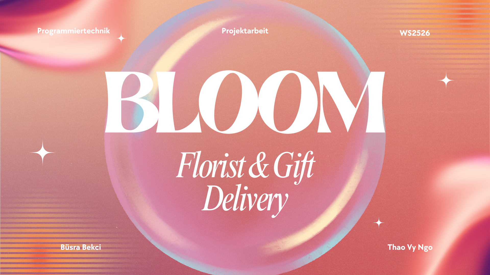

# 🌷 Bloom: Florist & Gift Delivery  

---

## Projektbeschreibung

**Bloom Delivery** ist eine Java-Swing-Anwendung, die sich an Nutzer:innen kleiner Lieferdienste richtet und die Erstellung, Berechnung sowie Verwaltung von Bestellungen für Blumen und weitere Artikel unterstützt.

Hier ist die Kategorie der Angebote aus unserem Programm:


**Bloom Delivery** bietet eine benutzerfreundliche Oberfläche und ermöglicht:
- Auswahl von Blumen- und Geschenkangeboten über Checkboxen
- Auswahl der Verpackungsart über eine ComboBox
- Berechnung des Gesamtpreises der Bestellung
- Eingabe der Empfängerinformationen *(Name, Telefonnummer, Adresse)*
- Auswahl von Lieferdatum und Lieferuhrzeit *(mit JCalendar und JSpinner)*
- Speichern und Anzeigen aller erstellten Bestellungen
- Zentrale Verwaltung der Bestellungen über eine Verwaltungsklasse

---

## Installation

**Systemanforderungen**

IntelliJ IDEA *(aktuelle Version mit Java-24-Unterstützung)*

**Installationsschritte**

Projekt von GitHub klonen:

```bash
git clone https://github.com/thaovyngo11/Delivery_BLOOM.git
cd iBeautyManager
```

---

## Anwendung starten

- Öffnen die Datei `Main.java` in IntelliJ IDEA.
- Rechtsklicken auf die Datei → **Run 'Main'** auswählen.

---

## Unser Video 

[](https://drive.google.com/file/d/1eBk7nGhdszOS2ea4sUm3sFB_zOpbqook/view?usp=share_link)

---

## UML-Diagramme


---

## Über unser Team

Wir, die **Gruppe 38**, bestehen aus **Thao Vy Ngo** und **Büsra Bekci**, sind IMUK-Studierende im 2. Semester an der Hochschule Neu-Ulm.
Die Java-Swing-Anwendung, **Bloom Delivery** wurde im Rahmen der Projektarbeit im Modul Programmiertechnik entwickelt.

**Bearbeitungszeitraum:** 

Das Projekt wurde im Wintersemester 2025/2026 durchgeführt.

**Ideenfindung & Motivation:**  

Online-Bestellungen sind aus dem Alltag nicht mehr wegzudenken.
Ausgehend von diesem Bedarf war es unser Ziel, eine einfache und benutzerfreundliche Java-Anwendung zu entwickeln, die objektorientierte Programmierung sinnvoll mit einer grafischen Benutzeroberfläche auf Basis von Java Swing verbindet.
Der Fokus liegt dabei auf der Perspektive der Dienstleistungsnutzer:innen sowie auf einer klaren Darstellung des Bestell- und Verwaltungsprozesses.

